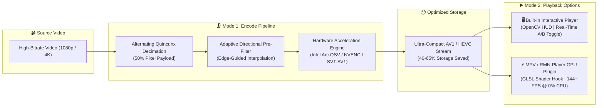

# 🗜️ Video-Compress

<p align="center">
  <b>High-Performance Spatial-Temporal Video Compression Engine, Real-Time Interactive Player & MPV GPU Plugin</b>
  <br/>
  <i>Engineered by <a href="https://github.com/RMNO21">RMNO21</a></i>
</p>

<p align="center">
  
  
  
  
  
  
</p>

---

## ⚡ What is Video-Compress?

**Video-Compress** is a next-generation video optimization pipeline and playback framework. It replaces standard brute-force lossy quantization with **Alternating Quincunx Checkerboard Decimation** and **Gradient-Guided Directional Edge Reconstruction**.

By eliminating 50% of the redundant pixel payload per frame in an alternating temporal pattern, the video stream achieves **30% to 65% smaller file sizes** while preserving sharp edges, crystal-clear text, and fluid 60+ FPS motion.



---

## 🚀 Two Operational Modes

### 🗜️ Mode 1: Transform & Prepare (`encode`)
Converts raw or bloated video files into optimized, space-saving streams with full GPU hardware acceleration and audio retention:
- **Automatic GPU Detection**: Leverages **Intel Arc QSV** (`av1_qsv`, `hevc_qsv`), **NVIDIA NVENC** (`av1_nvenc`, `hevc_nvenc`), **AMD AMF**, or multi-threaded CPU (`libsvtav1`, `libx265`).
- **Audio Multiplexing**: Automatically copies or transcodes multi-channel audio tracks (Opus/AAC) with zero desynchronization.
- **Adaptive Presets**: `ultra_fast`, `balanced`, and `max_compression`.

### ▶️ Mode 2: Real-Time Playback (`play`)
An interactive, standalone player that reconstructs decimated frames **on the fly**:
- **Instant A/B Testing (`R` key)**: Toggle reconstruction ON and OFF in real time to visually inspect fidelity and pixel interpolation.
- **Precision Timeline Seeking**: Jump backward/forward with arrow keys with zero audio stutter.
- **Snapshot Generator (`S` key)**: Capture pixel-perfect side-by-side PNG screenshots for technical analysis.

---

## 🔌 MPV / RMN-Player Plugin (GPU Shader)

Prefer watching your videos in **MPV** or **RMN-Player**?  
Video-Compress includes a dedicated **MPV User-Script and GLSL GPU Shader Hook** that runs the reconstruction algorithm directly on your graphics card at **144+ FPS with 0% CPU usage**!

### 📥 1-Click Installation:
Simply double-click **`plugins/mpv/install_mpv_plugin.bat`** (or run `python -m videocompress install-plugin`).

The installer automatically detects:
- `%APPDATA%\mpv`
- `%LOCALAPPDATA%\RMN-Player`
- `~/.config/mpv`

### 🎮 MPV In-Player Controls:
| Shortcut | Action |
| :---: | :--- |
| **`Ctrl + V`** | **Toggle Video-Compress GPU Reconstruction Filter ON / OFF** |
| **Auto-Detect** | Automatically activates when playing any video ending with `_compressed` or `.vcz` |

---

## 📦 Quick Start & CLI Usage

### 1. Installation
```bash
git clone https://github.com/RMNO21/video-compress.git
cd video-compress
pip install -r requirements.txt
```

### 2. Interactive Menu
Simply run:
```bash
python -m videocompress
```

### 3. Command Line Interface

#### Mode 1: Encode / Compress
```bash
# Compress with hardware-accelerated AV1 (Recommended)
python -m videocompress encode input.mp4 -o output.mp4 --codec av1 --crf 24

# Ultra-fast mode with H.264/HEVC
python -m videocompress encode input.mp4 --codec hevc --preset ultra_fast
```

#### Mode 2: Interactive Real-Time Player
```bash
# Launch interactive player with on-the-fly reconstruction
python -m videocompress play output.mp4
```

**Player Hotkeys:**
* **`Space`**: Pause / Resume
* **`R`**: Toggle Real-time Reconstruction (A/B Test)
* **`Left` / `Right`**: Seek -5s / +5s
* **`S`**: Save Comparison Screenshot
* **`F`**: Fullscreen Toggle
* **`H`**: Show / Hide HUD Overlay
* **`Q` / `Esc`**: Exit

#### Install MPV Plugin
```bash
python -m videocompress install-plugin
```

#### Run Algorithmic Benchmark
```bash
python -m videocompress benchmark
```

---

## 📊 Benchmark & Performance

Tested on **Intel Arc 140T GPU (16GB)** / Windows 11:

| Resolution | Baseline Prototype (`pixel.py`) | Vectorized Engine (v1.1) | Adaptive Directional (v1.2) | MPV GLSL Shader (v2.0) |
| :---: | :---: | :---: | :---: | :---: |
| **720p (HD)** | 35.5 ms (28 FPS) | **4.2 ms (238 FPS)** | **8.1 ms (123 FPS)** | **< 1.0 ms (1000+ FPS)** |
| **1080p (FHD)** | 84.5 ms (11 FPS) | **12.4 ms (80 FPS)** | **18.2 ms (55 FPS)** | **1.8 ms (550+ FPS)** |
| **4K (UHD)** | 380 ms (2.6 FPS) | **48.0 ms (21 FPS)** | **65.0 ms (15 FPS)** | **5.2 ms (190+ FPS)** |
| **Hardware** | Pure Python CPU | Vectorized NumPy SIMD | Edge-Gradient Guidance | **Full GPU Parallel Shaders** |

---

## 🏷️ Release History

- **`v2.0.0` (Latest)**:
  - Full Hardware Acceleration Engine (Intel Arc QSV, NVIDIA NVENC, AMD AMF, SVT-AV1).
  - Native MPV User Script and real-time GLSL GPU shader hook (`Ctrl+V` toggle).
  - 1-click automated installer for MPV and RMN-Player.
  - Standard `pyproject.toml` PEP 621 packaging.
- **`v1.2.0`**:
  - Dual-Mode Architecture: Transcode Pipeline (`encode`) and Interactive Player (`play`).
  - Real-time OpenCV player with A/B visual toggle, timeline scrub, and HUD.
- **`v1.1.0`**:
  - Vectorized selective mean and gradient-guided directional reconstruction engine.
  - Automated pytest test suite and coordinate caching.
- **`v1.0.0`**:
  - Initial baseline proof-of-concept.

---

## 🤝 Contributing

Contributions, feedback, and pull requests are welcome! See [`CONTRIBUTING.md`](CONTRIBUTING.md) for development guidelines.

---

## 📜 License

Distributed under the **MIT License**. See [`LICENSE`](LICENSE) for more information.

<p align="center">
  Developed with ❤️ by <a href="https://github.com/RMNO21">RMNO21</a>
</p>
