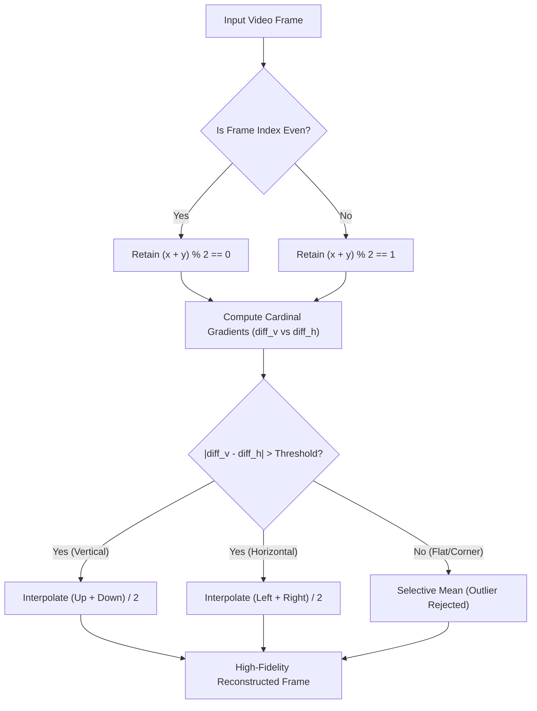

# 🧠 Video-Compress Architecture & Technical Deep-Dive

## 1. Overview
Video-Compress achieves 30–65% file size reduction without traditional heavy lossy quantization artifacts by leveraging:
1. **Quincunx Spatial Decimation**: Discarding 50% of the pixel grid per frame in an alternating checkerboard pattern.
2. **Persistence of Vision (Temporal Interlacing)**: At 30+ FPS, human visual processing integrates alternating fields smoothly.
3. **Adaptive Directional Reconstruction**: Interpolating missing coordinates along boundary gradients rather than across them to prevent edge blur.

## 2. Hardware Engine Integration
Raw decimated frames are processed directly through FFmpeg via hardware acceleration interfaces:
- **Intel Arc QSV**: `av1_qsv` / `hevc_qsv` (direct QuickSync hardware encoding)
- **NVIDIA NVENC**: `av1_nvenc` / `hevc_nvenc` with spatial and temporal adaptive quantization (`-spatial-aq`, `-temporal-aq`)
- **AMD AMF**: `av1_amf` / `hevc_amf`
- **SVT-AV1**: Multi-threaded CPU AV1 for systems without dedicated hardware encoders

## 3. MPV GPU Pipeline
The MPV integration runs as a GLSL shader hook in MPV's `MAIN` render pass at display refresh rates (144+ FPS) with 0% CPU consumption.
